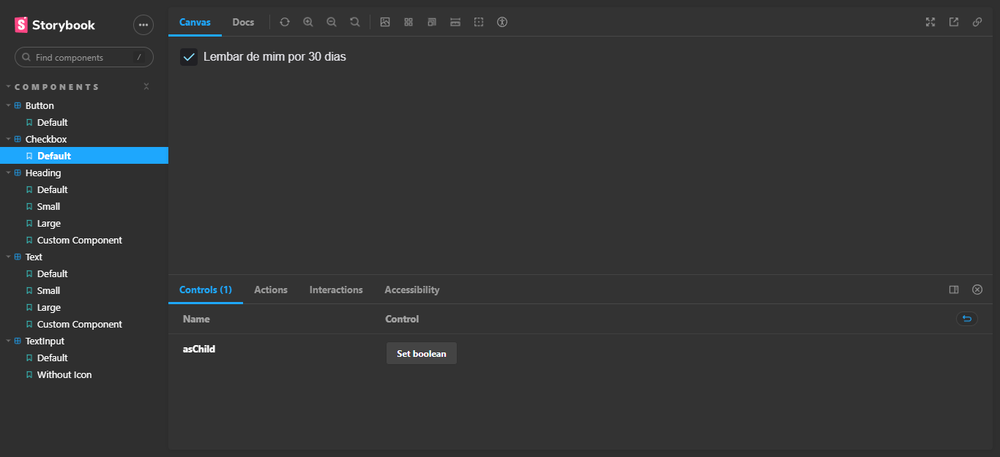

# Ignite Lab

> Trilha Design System
Projeto construido no evento Ignite Lab | React da Rocketseat.

## Tecnologias
- ReactJS
- TypeScript
- Storybook
- CSS (tailwind)
- Git e Github
- Figma
- Radix-ui
- Clsx
- Workflows

## Componentes documentados

> Link [Documento](https://gadiegon.github.io/ig-lab/?path=/story/components-checkbox--default)

## Figma Design System

> Link [Design](https://www.figma.com/file/y97FPqsKL8ICjgZa1GQpti/Ignite-Lab-Design-System?node-id=0%3A1)

## Curso

Rocketseat / Educador: Diego Fernandes.

## Contato

ngadiego@gmail.com
